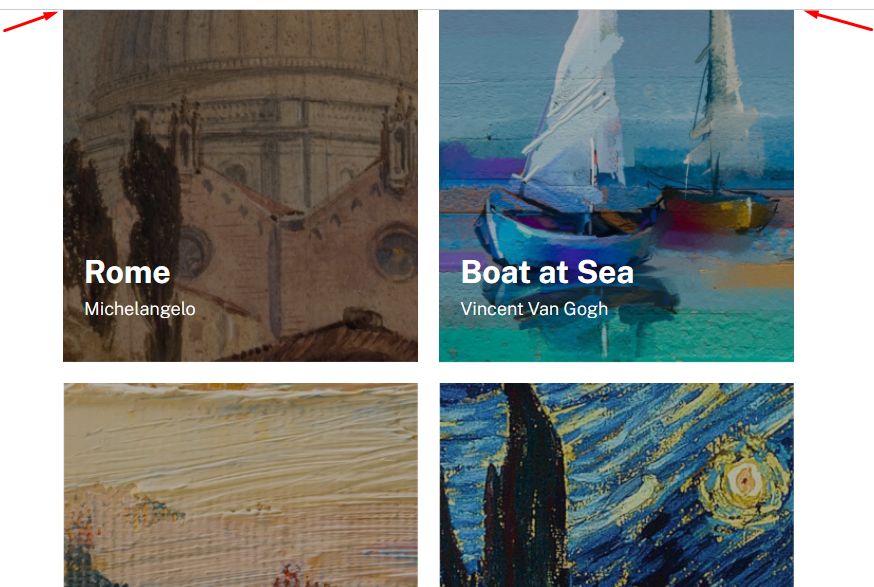

# desafio-lista-de-imagens

Realizei o desafio e consegui cumprir vizualmente, tudo o que se pedia, conforme "Figma".

## Dificuldades
Fazer as imagens responsivas, aumentando e diminuindo conforme tamanho da tela. Depois de "quebrar um pouquinho a cabeça", percebi que deveria inserir 100% na largura máxima da tag imagem.
``` 
li figure img {
    max-width: 100%;
}
```

Outro problema que só resolvi no final do projeto, comparando com o exemplo, foi a altura do body. 

Eu estava inserindo apenas height, cortando uns 100px de altura no início da página
quando o correto era min-height:
```
body {
    min-height: 100vh;
}
```

Considero resolvido os problemas foram resolvidos.

Vamos pro próximo projeto :D